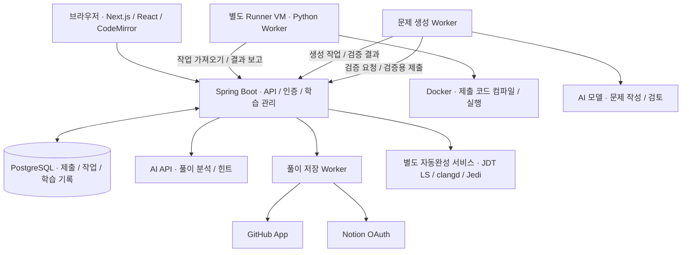
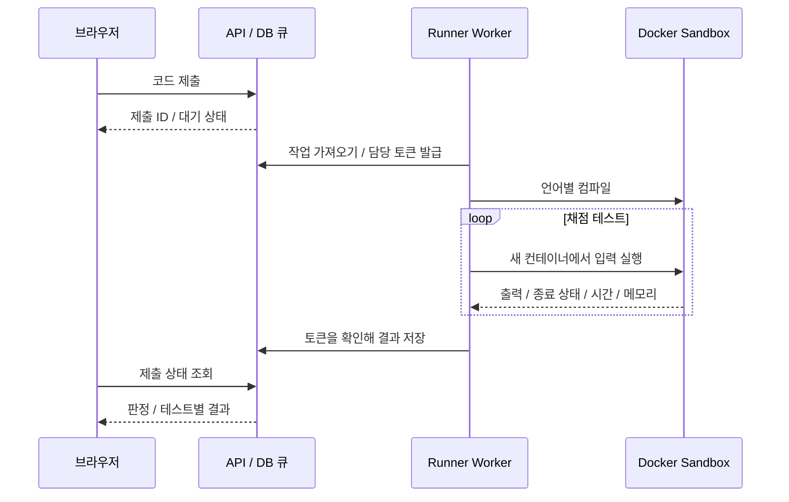
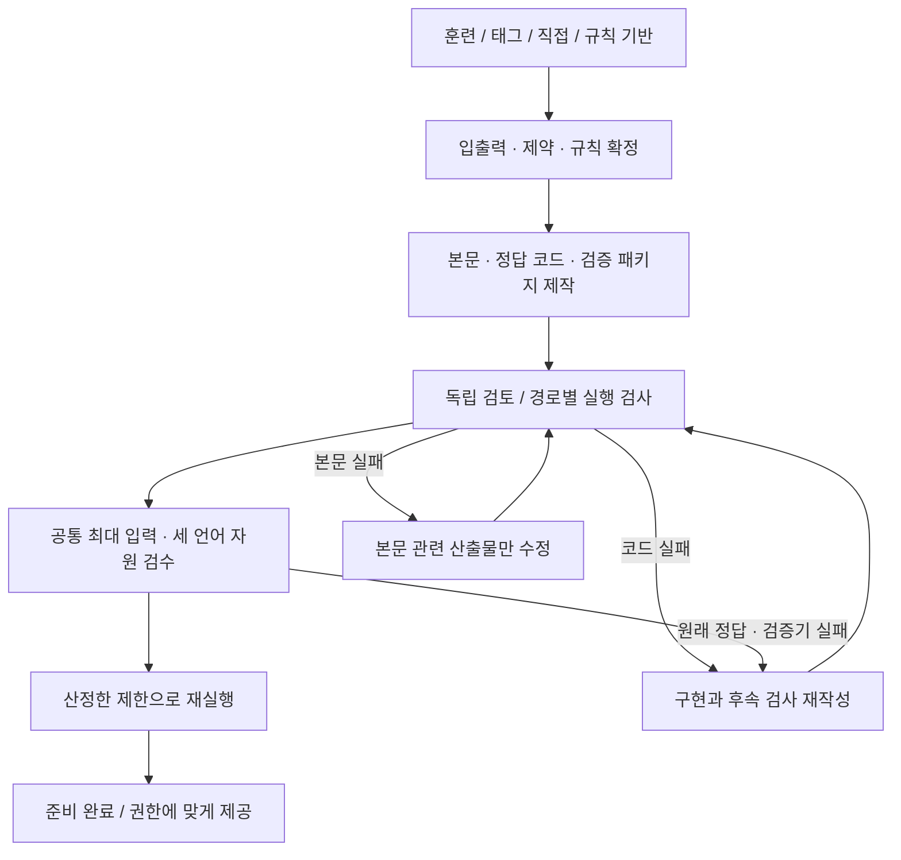

<p align="center">
  
</p>

<p align="center">
  <b>문제를 풀고, 나의 다음 연습까지 이어가는 코딩 학습 서비스</b><br>
  온라인 채점 · 선택 진단 · 맞춤 훈련 · AI 피드백 · 풀이 자동 기록
</p>

<p align="center">
  <a href="https://gamjaoj.gamjabox.cloud"><b>서비스 바로가기</b></a>
</p>

---

## 왜 만들었나

코딩 문제를 풀다 보면 익숙한 유형만 반복하거나, 정답을 맞힌 뒤에도 다음에 무엇을 공부할지 막히는 경우가 있다. GamjaOJ는 **정답을 확인하는 것에서 끝나지 않고, 부족한 부분을 찾아 다음 연습으로 연결하는 것**을 목표로 만든 개인 프로젝트다.

브라우저에서 코드를 작성하고 제출하면 채점 결과를 확인할 수 있다. 진단평가와 풀이 기록을 바탕으로 훈련 계획을 만들고, 기존 문제를 연결하거나 필요한 문제를 생성해 이어서 풀도록 구성했다. 풀이 자신감과 AI 코드 분석은 별도로 기록하여, 정답 한 번을 곧바로 숙련도로 판단하지 않도록 했다.

현재 실제 서버에서 운영하며 기능 구현뿐 아니라 제출 코드의 실행 격리, 생성 문제 검증, 재시도 처리와 화면 사용성까지 함께 개선하고 있다.

## 학습 흐름

**문제 탐색 또는 진단 → 코드 작성·제출 → 결과와 피드백 확인 → 다음 훈련 → 성장 기록**

진단평가는 선택 사항이다. 바로 문제를 풀거나, 제공되는 훈련 코스를 고르거나, 직접 연습 목표를 설정하는 방식도 지원한다.

## 주요 기능

| 기능 | 설명 |
| --- | --- |
| **온라인 채점** | Java 8·C++17·Python 3.12 실행과 제출. 채점 결과, 실행 시간, 메모리 사용량 확인 |
| **브라우저 에디터** | 언어별 자동완성, 코드 템플릿, Vim 모드, 글꼴·테마 설정, 초안 저장, 패널 순서·크기 조절. 명령 처리형 호출 테스트 편집·입력/출력 파일 불러오기 |
| **문제 탐색·출제** | 한글 분야 필터와 페이지네이션. 사용자가 만든 문제의 검증·공유, Markdown 본문과 설명 이미지 지원 |
| **선택 진단** | 기초 진단과 A/B형 대비 진단. A/B형은 각 4세트·32문항이며, 덜 노출된 세트를 우선 배정하고 재응시 여부 표시. B형은 Java·C++·Python `UserSolution` 방식 |
| **맞춤 훈련** | 진단 결과에서 계획을 생성하고 진행도·이어서 풀기를 제공. 적합한 접근 가능 문제를 우선 연결하고 부족한 문제는 생성 작업으로 준비 |
| **서비스 훈련 코스** | 입문·자료구조·탐색·그래프·동적 계획법 등 8개 코스. 수동 계획과 개인 훈련 기록도 별도 관리 |
| **풀이 피드백** | AI 분석·맞춤 힌트와 본인의 풀이 자신감을 구분해 기록. 최신 분석 요약을 먼저 보여주고 상세 내용·지난 기록은 펼쳐서 확인 |
| **마이페이지** | 활동 잔디, 성장 겹, 유형별 풀이 분포, 복습·편중 완화 제안, 풀어본 문제와 전체 제출 기록 |
| **공지·업데이트** | 상단 종 아이콘에서 공지·신규 기능·패치노트를 확인. 새 글 표시, 종류별 필터, 개별·모두 읽음 처리 |
| **GitHub·Notion 연동** | 정식 통과 풀이의 자동 저장 ON/OFF와 수동 저장. GitHub 겹별 폴더·README, Notion 표에 난이도·시간·메모리 기록 |

### 난이도: 생각의 겹

문제 난이도는 **1~9겹**으로 표시한다. `1겹 · 그대로`, `5겹 · 뒤집어보기`, `9겹 · 새로 짜기`처럼 숫자와 이름을 함께 보여주며, **발상·구현·경계 조건**의 부담도 구분한다.

다른 서비스의 레벨이나 티어를 그대로 환산하지 않고 문제별 검토 정보를 저장한다. 문제의 생각의 겹과 개인의 성장 겹은 서로 다른 지표이며, 겹 평가는 학습을 돕기 위한 추정치다.

## 아키텍처



프런트엔드는 정적 파일로 빌드해 Spring Boot 애플리케이션에서 함께 제공한다. 제출은 DB에 작업으로 저장하고, 별도 Runner가 가져가 실행한 뒤 결과를 보고한다. 브라우저는 작업 상태를 조회하므로 채점이 끝날 때까지 하나의 HTTP 요청을 오래 붙잡지 않는다.

사용자 코드는 웹 서버에서 직접 실행하지 않는다. Runner의 Docker 컨테이너에 네트워크·CPU·메모리·프로세스 수·실행 시간 제한을 적용하고, 실행할 언어 이미지와 명령은 서버가 관리한다.

### 백엔드 기능 패키지와 계층

백엔드는 **단일 Spring Boot 애플리케이션 안에서 기능을 먼저 나누는 구조**다. Maven 모듈이나 별도 서버로 분리하지 않고, 기능마다 API·DTO·서비스·도메인·저장소·인프라를 함께 배치한다. 계정 기능을 수정하면 `account` 안에서 요청부터 DB 접근까지 따라갈 수 있다.

```text
backend/src/main/java/dev/gamjaoj/
├── GamjaApplication.java
├── admin/         AdminConsole 호스트 진입·권한·운영 통합 조회
├── account/       계정·인증·초안·삭제
├── judge/         제출·실행·채점 큐·Runner 연동
├── problem/       문제 목록·해설·이미지·난도
├── diagnostic/    진단평가·진단 계획
├── learning/      훈련 코스·맞춤 학습·성장 기록
├── generation/    문제 생성·검수·복구·규칙 등록
├── ai/            풀이 분석·AI 예산·공용 Responses 클라이언트
├── export/        GitHub·Notion 풀이 저장
├── editor/        에디터 자동완성
└── shared/        공통 오류 처리·검증·겹 이름·JSON·SQL 조회 조각
```

예를 들어 `export`는 다음처럼 구성한다. 각 기능에는 실제로 필요한 계층만 둔다.

```text
export/
├── api/             ExportController — HTTP 진입점
├── dto/             ExportDtos — 요청·응답 계약
├── service/         SolutionExports — 업무 규칙·트랜잭션
├── repository/      저장 설정·작업 SQL과 잠금
├── infrastructure/  GitHub·Notion HTTP, 토큰 암호화, ExportWorker
└── config/          ExportSettings
```

기능 내부의 요청 흐름은 **API Controller → Service → Repository**다. 컨트롤러는 DB에 직접 접근하지 않는다. 서비스가 권한·상태·중복 요청을 판단하고, Repository가 `JdbcClient`로 SQL을 실행한다. 기존 트랜잭션·행 잠금·담당 토큰 검증은 같은 작업 경계에서 유지한다. 주기적 Worker와 외부 클라이언트는 해당 기능의 `infrastructure`에 둔다.

기능 간 협력은 다른 기능의 서비스나 데이터 계약을 통해 이루어지고, **다른 기능의 Repository에 직접 접근하지 않는다**. `shared`는 기능 구현에 의존하지 않는다. 여러 조회에서 쓰는 난도 SQL projection은 `shared/repository/ProblemSql`로 공유하며, DB 접근과 저장소 Bean은 각 기능이 소유한다. 서비스가 HTTP 컨트롤러를 참조하거나, Domain·DTO·Repository가 상위 서비스 구현을 참조하는 역방향 의존성도 금지한다. [구조 검사](backend/src/test/java/dev/gamjaoj/architecture/BackendArchitectureTest.java)가 기능 패키지·계층 방향·저장소 소유권·SQL 위치를 전체 백엔드 테스트와 함께 확인한다.

현재 기능들은 하나의 프로세스와 DB, 기존 트랜잭션을 공유한다. 패키지로 책임과 접근 경계를 정리한 구조이며, 기능 간 완전한 의존성 분리나 독립 배포를 구현한 것은 아니다.

## AdminConsole와 프런트 서빙

프런트는 Next.js/React의 **정적 export**다. `next build` 결과인 `frontend/out`을 Spring Boot JAR의 `static`에 포함하므로 운영에서 별도 Node/Vite 컨테이너나 프런트 포트를 열지 않는다. HTML·JS·CSS와 API 모두 같은 application 포트에서 제공한다.

AdminConsole는 같은 빌드에 포함된 별도 운영 화면이다. Spring이 요청의 **Host**를 보고 `/`에서 GamjaOJ 또는 AdminConsole HTML을 선택한다. CNAME은 DNS 연결만 담당하며, 실제 화면 분기는 HTTP Host로 결정한다. AdminConsole 초기 화면은 관리자 로그인과 회원·공개 문제 수, 채점·문제 생성·AI 작업 상태 조회를 제공한다.

```dotenv
# 서버의 기존 .env에 추가. 호스트만 입력하고 스킴·포트·경로는 제외한다.
CONTROL_OJ_HOST=admin.example.com
CONTROL_OJ_ADMIN_USERS=operator-example
```

`CONTROL_OJ_HOST`를 비우면 관리 라우트는 비활성화된다. 관리자 목록은 쉼표로 구분한 **정확한 기존 계정 아이디**이며, 비어 있으면 어떤 회원도 관리 API에 접근할 수 없다. AI 운영자 설정과 별개다. 관리자 목록 검사는 매 요청에 적용하며, 공개 회원가입으로 관리 권한을 얻을 수 없다.

비공개 프록시 라우트에서 AdminConsole 호스트를 **GamjaOJ와 동일한 upstream 포트**로 연결하고 원래 `Host` 헤더를 보존한다. 외부 TLS·비공개 접근 정책은 프록시에서 적용한다. 이 서버는 `X-Forwarded-Host`로 관리 화면을 선택하지 않는다. 두 호스트의 API 요청은 각자 동일 출처에서 이루어지므로 추가 CORS 설정은 필요 없다. 로그인 쿠키는 호스트별로 유지되어 AdminConsole에서 따로 로그인한다.

일반 호스트에서는 `/admin-console`, `/admin-console.html`, 관련 페이지 payload 및 `/api/admin/**`가 404다. AdminConsole 호스트에서도 관리 API는 로그인하지 않으면 401, 지정된 관리자가 아니면 403이다. 비공개 라우트와 별도로 서버 권한 검사를 유지하고, 기존 CSRF 보호를 그대로 사용한다. Host 분기는 관리 권한을 대신하지 않는다.

로컬에서는 `CONTROL_OJ_HOST=admin-console.localhost`로 설정하고 같은 포트의 `localhost`와 `admin-console.localhost`에 접속해 두 화면을 비교할 수 있다. 환경변수를 변경하면 application 컨테이너를 다시 생성해야 한다.

## 러너는 어떻게 채점하나

**제출을 저장하는 서버와 코드를 실행하는 서버를 분리**했다. 웹 서버는 권한·문제 버전·언어를 확인하고 제출을 큐에 넣는다. 별도 Runner Worker가 작업을 가져가 컴파일·실행하고, 결과를 서버에 보고한다.



1. **작업 확보:** DB 트랜잭션과 잠금으로 같은 작업의 중복 배정을 막는다. Worker는 담당 토큰과 유효 기간을 받고, heartbeat로 작업 중임을 알린다. 중단된 Worker의 작업은 제한된 횟수 안에서 재배정한다.
2. **컴파일:** 서버가 지정한 언어 이미지·명령으로 빌드한다. 이미지 digest와 실행 정책을 제출 시점의 기록에 연결해, 실행 환경이 바뀌어도 이전 제출의 기준을 구분한다.
3. **테스트 실행:** 컴파일 산출물을 읽기 전용으로 연결하고 테스트마다 새 컨테이너에서 실행한다. 명령 처리형은 서버가 만든 언어별 드라이버가 `UserSolution`을 호출하고 결과를 비교한다.
4. **판정·저장:** 출력 비교와 종료 상태로 AC·WA·CE·RE·TLE·MLE 등을 판정한다. 정식 제출은 테스트별 결과를 수집하며, 생성 문제의 검증용 실행은 첫 실패에서 중단한다. 오래된 담당 토큰의 보고는 거부하고, 같은 결과의 재전송은 중복 반영하지 않는다.

동시 실행 수는 **Worker 수와 설정된 슬롯 수로 제한**한다. 슬롯보다 많은 제출은 DB 큐에서 기다린다. Docker 자체가 요청량에 맞춰 자동 증설하는 구조는 아니며, 병렬 실행과 단독 측정은 별도 실행 모드로 조절한다. 큰 생성 입력의 버퍼도 별도 동시 처리 제한을 둔다.

시간은 Runner가 관측한 실행 구간의 **벽시계 시간**으로, 런타임 시작과 실행 환경의 영향이 포함된다. 컴파일 시간은 실행 시간과 구분한다. 메모리는 코드가 출력한 값이 아니라 호스트에서 관측한 **컨테이너 cgroup 최고 사용량**이며, JVM·인터프리터·파일 캐시 등이 포함될 수 있다. 메모리 관측에 실패하면 0으로 채우지 않는다.

관련 코드: [작업 큐](backend/src/main/java/dev/gamjaoj/judge/service/JudgeQueue.java) · [Runner Worker](runner/worker.py) · [컴파일·실행](runner/judge.py) · [슬롯 제어](runner/scheduling.py) · [메모리 관측](runner/memory_peak.py)

## 문제 생성과 검수 파이프라인

**AI가 원고를 작성하는 단계와 문제를 제공할 수 있다고 판단하는 단계를 분리**했다. 훈련·태그·직접·규칙 기반 생성은 시작 방식이 다르지만, 새로 생성한 문제는 실행 검증과 공통 자원 검수를 거쳐야 준비 상태가 된다. 비공개 문제를 게시하더라도 소유권과 접근 권한은 유지한다.

| 진입 방식 | 생성 흐름 |
| --- | --- |
| **훈련** | 접근 가능한 기존 문제를 먼저 탐색 → 적합한 문제 연결 → 없으면 직접 생성 작업으로 준비. 같은 계획·생성 작업의 진행 상태를 이어받음 |
| **태그** | 선택한 분야·태그의 정의로 코드·본문 작성 → 별도 본문 검토 → 경로별 실행 검증 |
| **직접** | 요청에서 명세 작성 → 정답·검증기·테스트 제작 → 예비 실행 → 독립 검토 → 최종 검사. 수동 단계 진행도 지원 |
| **규칙 기반** | 고정 계약을 기준으로 코드·본문 작성 → 본문만 읽는 독립 해석과 oracle 제작 → 실행·내용 검토. 문제가 생긴 역할과 의존 단계만 복구 |



### 검증기는 무엇을 확인하나

입력 검증기, 정답 비교용 oracle, 생성 단계 검수는 서로 다른 역할이다. 하나의 모델이 “맞다”고 평가한 것으로 끝내지 않고 **저장된 코드와 실제 Runner 실행 결과**를 함께 사용한다.

| 검증 층 | 확인하는 내용 |
| --- | --- |
| **구조·계약** | 필수 필드·길이·언어, 입력 형식과 범위, 고정 규칙과 산출물의 일치 여부 |
| **독립 본문 검토** | 본문만으로 규칙을 해석할 수 있는지, 모순이나 누락이 있는지. 경로에 따라 저자의 코드를 보지 않고 별도 정답 프로그램 작성 |
| **입력 검증기** | 테스트가 공개된 제약 안에 있는지. 잘못된 입력을 정답의 반례로 사용하지 않도록 검사 |
| **정답·oracle 비교** | 공개 예제와 작은 생성 입력에서 정답 코드와 다른 방식의 oracle 결과가 일치하는지 |
| **오답 표적 검사** | 예제를 통과하는 논리 오답이 비공개 반례에서 실패하는지. 경로별 검증 패키지에 따라 수행 |
| **유형별 검사** | 30개 유형 프로필에서 필요한 경계 조건 선택: 정수 범위·동률·상태 초기화·반복 갱신·그래프 구조·배치 합계 등 |
| **공통 자원 검수** | 최대 입력 계획의 독립 검토, 세 언어 정답과 일반적인 Java 대안 풀이의 시간·메모리 측정, 최종 제한 재실행 |

작은 입력의 oracle은 정확성 비교를 위한 도구이며, 최대 입력의 성능 측정과 구분한다. 기존 문제 전수검증에서 정리한 유형별 기준을 재사용하지만, **기존 문제의 인증서를 새 문제의 검증 결과로 대신하지 않는다.**

### 시간·메모리는 어떻게 정하나

새 문제는 최대 입력 생성 계획을 별도로 검토한 뒤, 원래 입력 검증기와 **C++·Java·Python 정답 + 일반적인 Java 대안 풀이**를 실제 Runner에서 실행한다. 기준 실행 9개와 최종 제한 재실행 4개, 총 **13개 실행**을 확인한다.

- **시간:** 일반 문제는 실측 최대 시간의 3배에 1초를 더하고, 0.25초 단위로 올린다. 최소 C++ 3초·Java 5초·Python 8초로 런타임 시작과 일반적인 구현 차이를 수용한다.
- **메모리:** 관측한 cgroup 최고 사용량의 1.2배에 8MiB를 더해 16MiB 단위로 올린다. 언어별 하한과 고정 실행 환경의 상한을 함께 적용한다.
- **마지막 확인:** 산정한 제한으로 다시 실행한다. 관측 누락이나 실행 상한 초과는 추정치로 덮어 게시하지 않는다.

이 정책은 새 생성 작업에 적용한다. 기존 제출·진단의 저장된 실행 기준과 과거 검증 기록은 유지한다. 네 가지 최대 입력과 독립 검토는 제한된 검증 증거이며, 모든 최악 입력이나 가능한 정답 구현을 증명하는 것은 아니다.

관련 코드: [유형별 검수 기준](generation/resource-profiles-v1.json) · [예비 실행 검사](backend/src/main/java/dev/gamjaoj/generation/service/ExperimentalChecks.java) · [공통 자원 검수](backend/src/main/java/dev/gamjaoj/generation/service/GenerationResources.java) · [검수·복구 계약](generation/VALIDATION.md)

## 실패 복구와 안전장치

생성 실패 때 전체를 무조건 다시 만들면 비용이 늘고 이미 검증한 코드까지 바뀐다. **실패한 단계와 그 결과에 의존하는 단계만 다시 처리**하고, 이전 산출물·실행·사용량은 감사 기록으로 보존한다.

| 실패 상황 | 처리 |
| --- | --- |
| **본문·해설의 길이/형식 오류 또는 본문 검토 거절** | 문제가 있는 텍스트·본문 관련 단계만 수정. 성공한 코드·oracle과 고정된 입출력 계약 보존 |
| **정답 코드·입력 검증기의 실패** | 구현과 영향을 받는 후속 검사 재작성. 최대 입력을 줄여 실패를 숨기지 않음 |
| **명세 자체의 충돌** | 명세부터 다시 생성하며 이전 계약과 실행 기록 보관 |
| **자원 관측 누락** | 저장된 코드·입력 계획으로 재측정. 관측 누락 자체를 이유로 모델을 다시 호출하지 않음 |
| **인증·할당량·외부 장애·사용량 불명·취소·한도 도달** | 보류 또는 중단. 무제한 자동 호출하지 않음 |

재시도는 제한되어 있다. 직접 생성은 단계별 보완 최대 3회·전체 최대 6회, 태그 생성은 최대 3회 보완, 규칙 기반은 역할당 총 3개 시도·추가 복구 전체 최대 6회다. 공통 자원 검수는 최초 시도와 추가 2회로 제한한다. 훈련은 새 유료 작업을 계속 만들지 않고 기존 생성 작업을 이어간다.

| 안전장치 | 목적 |
| --- | --- |
| **실행 격리** | 비특권 사용자, 네트워크 차단, 읽기 전용 파일시스템과 작업 마운트, Linux capability 제거, 권한 상승 금지. CPU·메모리·프로세스·파일·출력·시간 제한 |
| **서버가 정한 실행 정책** | 사용자나 모델이 임의의 이미지·실행 명령·제한을 선택하지 못하게 하고, 언어별 정책과 이미지 digest 확인 |
| **소유권·CSRF·비공개 분리** | 문제·제출·생성 작업의 접근 권한 확인. 검증용 실행을 개인 풀이 기록과 활동 잔디에서 분리 |
| **버전·해시·담당 토큰 확인** | 수정 전 검수 결과나 만료된 Worker 응답이 현재 문제를 승인하지 못하도록 차단 |
| **멱등 처리·상태 저장** | 같은 요청·결과의 재전송을 중복 반영하지 않고, 저장된 단계와 실행 기록으로 재시작 후 복구 |
| **API 예산·사용량 기록** | 호출 전 예산 예약, 결과와 사용량 저장. 응답 유실로 사용량이 불명확하면 0원으로 정산하거나 자동 재호출하지 않음 |

Docker 격리는 호스트 커널을 공유하므로 보안 경계에 한계가 있다. 별도 Runner 서버와 제한된 권한을 함께 사용하며, 격리 설정만으로 모든 위험이 사라진다고 보지는 않는다.

관련 코드: [실행 정책](runner/execution-profile.json) · [직접 생성 복구](backend/src/main/java/dev/gamjaoj/generation/service/GenerationDraftRecovery.java) · [규칙 기반 복구](backend/src/main/java/dev/gamjaoj/generation/service/HybridStageRecovery.java)

## 기술 스택

| 영역 | 기술 | 사용 목적 |
| --- | --- | --- |
| **Backend** | Java 21, Spring Boot 3.5, Spring Security, Spring JDBC | API, 인증·권한, 작업 상태와 트랜잭션 관리 |
| **Database** | PostgreSQL, Flyway, Spring Session JDBC | 제출·학습·세션 저장, DB 변경 이력 관리 |
| **Frontend** | Next.js 16, React 19, JavaScript, CodeMirror 6 | 정적 빌드, 풀이 화면과 코드 편집기 |
| **Worker** | Python, Docker | 제출 코드 채점, 문제 생성·검증 작업 |
| **Integration** | AI API, GitHub App, Notion OAuth | 학습 피드백, 문제 생성, 풀이 기록 |
| **Testing** | JUnit, Spring Boot Test, H2, Python unittest, Playwright | 서버·검증 도구·브라우저 동작 검사 |

애플리케이션 서버는 Java 21을 사용하고, **사용자가 제출하는 Java 코드는 Java 8 기준으로 채점**한다. 서버 개발 환경과 문제 풀이 환경을 구분했다.

## 구현에서 중요하게 본 점

### 1. 오래 걸리는 작업은 요청과 분리

채점·문제 생성·외부 업로드는 즉시 끝나지 않는 작업이다. 요청을 받으면 작업과 상태를 DB에 저장하고 Worker가 처리하도록 했다. 같은 요청을 다시 보내도 새로운 작업을 무조건 만들지 않도록 요청 키를 확인하고, 작업 담당 Worker와 유효 시간을 검사한다.

현재 규모에서는 DB 기반 작업 큐를 사용한다. 별도 메시지 브로커를 추가하기보다 이미 사용하는 PostgreSQL 안에서 작업 상태와 사용자 기록을 함께 관리하는 방식을 선택했다.

### 2. AI가 만든 문제도 실제로 검증

문제 작성이 끝났다는 이유만으로 바로 공개하지 않는다. 경로에 따라 정답 코드 실행, 작은 입력의 독립 정답 비교, 예제를 통과하는 오답 코드가 숨은 테스트에서 실패하는지 확인하는 검증 등을 수행한다. 검증 결과는 정확한 문제 버전에 연결하며, 준비·검토 조건을 충족한 문제만 제공한다.

AI 분석은 학습 제안으로 취급하고 채점 결과를 바꾸지 않는다. 동일한 분석은 재사용하고, API 비활성 상태나 예산 부족은 사용자에게 보류 상태로 표시한다.

### 3. 진단 결과를 실제 연습에 연결

맞춤 계획의 단계에 맞는 기존 문제를 먼저 찾는다. 본인이 만든 문제와 다른 사용자의 공개 문제도 접근 권한과 준비 상태를 확인한 뒤 후보에 포함한다. 적합한 문제가 없으면 생성 작업으로 넘기고 준비 상태를 표시한다.

진단·계획·훈련 기록은 DB에 저장한다. 화면을 다시 열어도 진행 중인 계획을 이어갈 수 있고, 서비스 코스는 등록 시점의 구성을 보관해 이후 코스 수정이 기존 학습 순서를 바꾸지 않도록 했다.

## 대표 트러블슈팅

실제 수정 사례와 재시도 검증에서 다룬 실패 조건을 함께 정리했다. **문제 → 원인 → 해결 → 확인** 순서로 읽을 수 있다.

### 1. 문제를 바꿨는데 이전 문제의 내용이 남음

- **문제:** 다른 문제의 풀기를 눌러도 이전 본문이나 이미지가 섞여 보였다.
- **원인:** 문제 전환 때 남은 화면 상태와 늦게 도착하는 이전 요청의 응답을 함께 관리해야 했다.
- **해결:** 문제 선택 진입점을 통일하고 본문·이미지를 문제 버전에 연결했다. 전환 즉시 이전 제출 상세를 비우고, 이전 요청 결과가 새 선택을 덮어쓰지 않도록 했다.
- **확인:** 이전 이미지 응답을 일부러 늦게 보내는 브라우저 테스트와 반복 전환 테스트로 본문 분리와 코드 초안 보존을 확인했다.

관련 코드: [Workspace](frontend/app/workspace.js) · [문제 전환 테스트](frontend/tests/problem-switch.spec.mjs)

### 2. 외부 업로드에서 응답을 잃으면 중복 저장될 수 있음

- **문제:** GitHub·Notion이 저장을 완료했지만 응답만 유실된 경우, 단순 재시도는 파일이나 페이지를 다시 만들 수 있다.
- **원인:** 로컬 요청의 실패만으로 외부 서비스의 저장 실패를 판단할 수 없다.
- **해결:** 업로드 경로와 페이지 ID를 중간 상태로 저장하고, 자동 관리 표시와 기록 ID로 기존 결과를 확인한 뒤 이어서 처리한다. 저장 여부를 확인할 수 없으면 무작정 재생성하지 않는다. Notion의 개인 회고는 갱신 대상에서 제외한다.
- **확인:** 응답 유실·부분 저장 후 재시작·같은 요청 재전송을 테스트하여 저장 위치 재사용과 중복 생성 방지 동작을 확인했다. 이 회귀 테스트의 외부 API는 mock이며 실제 provider 장애를 재현한 결과와는 구분한다.

관련 코드: [풀이 저장](backend/src/main/java/dev/gamjaoj/export/service/SolutionExports.java) · [GitHub 경로 테스트](backend/src/test/java/dev/gamjaoj/GitHubSolutionLayoutTest.java) · [Notion 저장 테스트](backend/src/test/java/dev/gamjaoj/NotionTablesTest.java)

### 3. 로컬 테스트는 통과했지만 운영 DB 마이그레이션이 실패

- **문제:** 진단 문항 역할을 확장하는 마이그레이션이 운영 PostgreSQL에서 실패했다.
- **원인:** 제약조건 조회가 수정할 난이도 CHECK 외에 PostgreSQL의 NOT NULL 관련 항목까지 포함했다. H2 테스트만으로는 이 차이가 드러나지 않았다.
- **해결:** 변경할 CHECK 조건만 찾도록 조회를 수정했다. 기존 운영 버전을 복구한 뒤 별도 PostgreSQL 17 환경에서 관련 테스트를 통과시키고 다시 배포했다.
- **확인:** 진단 통합 테스트 39개와 이후 전체 검증을 통과했다. DB 관련 변경은 가벼운 테스트 DB뿐 아니라 운영 DB의 동작도 확인해야 한다는 점을 배웠다.

관련 코드: [V75 마이그레이션](backend/src/main/java/db/migration/V75__exam_diagnostic_roles.java) · [진단 통합 테스트](backend/src/test/java/dev/gamjaoj/DiagnosticIntegrationTest.java)

### 4. 테마를 바꾼 직후 색상을 저장하면 다른 테마에 반영됨

- **문제:** 다크 모드에서 바꾼 색상이 라이트 모드 설정에 저장되는 경우가 있었다.
- **원인:** 실제 화면의 테마 변경과 React 상태 갱신 사이에 시차가 있어, 저장 함수가 이전 모드의 값을 읽었다.
- **해결:** 테마 선택 시 상태를 즉시 갱신하고, 색상 저장 시 현재 활성 모드와 최신 설정을 기준으로 처리했다.
- **확인:** 모드 전환 직후 색상 변경·저장·새로고침을 반복하여 라이트/다크 설정이 각각 유지되는지 확인했다.

관련 코드: [화면 설정](frontend/app/appearance-settings.js) · [테마 테스트](frontend/tests/appearance.spec.mjs)

### 5. 피드백 기능이 늘면서 사이드바가 지나치게 길어짐

- **문제:** 회고 입력, AI 분석, 추가 질문, 지난 기록과 다음 훈련 설정이 모두 펼쳐져 핵심 피드백을 찾기 어려웠다.
- **해결:** 최신 분석 요약을 먼저 보여주고 상세 내용·질문·회고·지난 기록을 단계적으로 펼치도록 변경했다. 접힌 입력도 유지하여 열고 닫는 과정에서 초안이 사라지지 않게 했다.
- **확인:** 390·1024·1440px에서 긴 분석 12개, 키보드 펼침, 질문·회고 초안 보존과 후속 훈련 연결을 확인했다. 관련 UI 테스트 20개를 통과했다.

관련 코드: [AI 피드백](frontend/app/ai-feedback.js) · [사이드바 테스트](frontend/tests/feedback-sidebar.spec.mjs)

### 6. 생성 작업을 조회할 때 DB 커넥션풀이 고갈됨

- **문제:** 생성 작업·규칙 등록 상태를 여러 요청이 동시에 조회하면 JDBC 연결 대기 시간이 초과되고, 다른 조회와 Worker의 작업 가져오기까지 밀렸다.
- **원인:** 조회 결과를 객체로 바꾸는 `row mapper` 안에서 부가 정보를 얻기 위한 DB 조회를 다시 호출했다. 첫 조회가 연결을 잡고 있는 동안 두 번째 연결을 기다리는 구조였다. 연결 5개를 쓰는 풀에서 요청 5개가 각각 하나를 점유하면, 모두 추가 연결을 기다려 풀이 고갈될 수 있었다.
- **해결:** `row mapper`는 현재 행의 값만 추출하도록 바꿨다. 첫 조회가 끝나 연결이 반환된 뒤 부가 정보를 조회하도록 분리하고, 중복 조회도 제거했다. 생성 작업·규칙 등록·후속 연습의 같은 패턴을 수정했으며 풀 크기와 timeout은 유지했다.
- **확인:** 실제 Hikari 풀에서 동시 조회 5개로 기존 코드의 `active 5 / pending 6` 상태를 재현했다. 수정 후 같은 동시 조회와 Worker 작업 확보가 완료됐고, 운영 PostgreSQL과 인증 HTTPS를 통한 57개 동시·혼합 조회도 모두 성공했다. 해당 점검의 최대 응답 시간은 0.749초였다.

핵심은 연결 수를 늘리기 전에 **한 요청이 연결을 보유한 채 또 다른 연결을 기다리는지 확인하는 것**이었다. 과거 장애 순간의 thread dump가 없어 당시 모든 timeout의 단일 원인을 확정한 것은 아니지만, 이 고갈 패턴 자체는 재현하고 수정했다.

관련 코드: [생성 작업 조회](backend/src/main/java/dev/gamjaoj/generation/service/GenerationJobs.java) · [규칙 등록 조회](backend/src/main/java/dev/gamjaoj/generation/service/HybridRuleOnboarding.java) · [커넥션풀 동시 조회 테스트](backend/src/test/java/dev/gamjaoj/ConnectionPoolReadIntegrationTest.java) · [운영 조회 점검](scripts/smoke-pool-reads.py)

## 검증 방식

| 대상 | 확인 내용 |
| --- | --- |
| **서버** | 소유권·CSRF·제출 조건·작업 재시도·진단 배정·훈련 상태. 최근 전체 Maven 검증 469개 통과 |
| **채점 환경** | 정답·오답·컴파일 오류·시간 초과와 실행 메타데이터. 문제별 실제 Runner 검증 |
| **브라우저** | 모바일·데스크톱 배치, 코드 초안·undo, 문제 전환, 질문·회고 보존, 테마와 폼 동작 |
| **운영 점검** | 실제 로그인·이미지 권한·요청 재전송·서버 재시작 후 상태 복원 |

새 생성 파이프라인의 대표 태그·직접 생성은 실제 모델 호출, 세 언어 자원 검수, 비공개 게시와 소유자의 정답 제출 AC까지 확인했다. 규칙 기반 생성의 공통 검수·복구 경로는 통합 테스트로 확인했지만, 최근 실제 종단 검증은 독립 검토 모델의 외부 서버 오류(5xx)로 중단됐다. 이 경로의 실제 게시 성공까지 검증한 것으로 표시하지 않는다.

A/B형 진단 64문항은 실제 Runner에서 128개 언어별 정답 프로그램과 1,848개 고정 테스트 실행을 확인했다. 이 결과는 해당 검증 범위의 통과 기록이며, 모든 최악 입력이나 진단 세트의 난도 동등성을 보장하는 수치는 아니다.

## 프로젝트 구조

```text
GamjaOJ/
├── frontend/       화면, 코드 에디터, Playwright 테스트
├── backend/        API, 인증, 학습 관리, DB 마이그레이션
├── runner/         격리 채점 Worker와 언어별 실행 정책
├── generation/     문제 생성 Worker와 검토·난이도 기준
├── diagnostics/    진단 은행 변환·검증 도구
├── completion/     언어별 자동완성 서비스
├── problems/       공개 문제 메타데이터·출처·설명 이미지
├── tests/          Python 검증 도구 테스트
├── scripts/        빌드, 검증, 배포 도구
└── deploy/         Docker와 서비스 실행 설정
```

## 공지와 패치노트 관리

상단 종 아이콘에서 로그인 여부와 관계없이 서비스 소식을 확인할 수 있다. 공지 창을 여는 것만으로 읽음 처리하지 않고, 글을 펼치거나 **모두 읽음**을 눌렀을 때 저장한다. 읽음 상태는 계정별로 이 브라우저에 보관하므로 다른 기기에서는 다시 새 글로 보일 수 있다.

공개 소식은 [announcements.js](frontend/app/announcements.js)에서 관리한다. 새 글에 고유한 ID, 종류(공지·새 기능·업데이트), 게시일, 제목, 요약, 본문을 추가하고 프런트엔드를 빌드·배포하면 반영된다. 기존 글의 ID는 유지하고 새 공지를 올릴 때 새 ID를 사용한다. 배열은 최신순으로 정렬하며 고정 이용 안내는 맨 위에 둔다. 대기열 안내는 상시 이용 안내이고 현재 서버 대기 인원을 실시간으로 표시하는 지표는 아니다.

## 빌드와 테스트

필요한 환경은 **Node.js 20.9 이상, Docker, Python 3.9 이상**이다. 백엔드는 Java 21을 사용하며, 아래 전체 빌드 스크립트는 고정된 Maven 컨테이너 안에서 실행한다.

```sh
# 프런트엔드 빌드 + 백엔드 패키징·전체 테스트
./scripts/build-web.sh

# Python 검증 도구 테스트: 일부 검사는 Docker나 별도 실행 환경 필요
python3 -m unittest discover -s tests
```

빌드된 화면을 로컬에서 열어 UI 회귀 테스트를 실행할 수도 있다.

```sh
# 터미널 1: 빌드 결과 제공
python3 -m http.server 18788 --bind 127.0.0.1 --directory frontend/out
```

```sh
# 터미널 2: API fixture를 사용하는 화면 테스트
cd frontend
npx playwright install chromium
GAMJAOJ_BASE_URL=http://127.0.0.1:18788 npx playwright test \
  tests/feedback-sidebar.spec.mjs tests/solving-layout.spec.mjs --workers=2
```

위 화면 테스트는 실제 채점 서버나 유료 AI를 호출하지 않는다. 서비스 전체 실행에는 PostgreSQL, Worker와 환경변수 설정이 추가로 필요하며, 정적 파일 서버만으로 채점 기능이 동작하지는 않는다.

운영 자격증명·환경변수 파일·SSH 접속 정보와 비공개 문제 패키지는 저장소에 포함하지 않는다. 운영 스크립트는 `GAMJAOJ_APP_SSH_TARGET`, `GAMJAOJ_RUNNER_SSH_TARGET`, `GAMJAOJ_BASE_URL` 등의 명시적 로컬 설정을 사용한다.

## 현재 범위와 다음 개선

- A/B형 진단은 학습용 시범 진단이다. 공식 시험·합격 예측 도구가 아니며 실제 학습자 데이터에 따른 세트 난도 보정이 필요하다.
- 자동완성은 단일 파일과 설치된 표준 라이브러리를 기준으로 한다. 외부 프로젝트 의존성이나 IDE 수준의 리팩토링은 지원하지 않는다.
- 메모리는 Runner가 관측한 컨테이너 cgroup 최고 사용량으로, JVM·런타임과 파일 캐시를 포함한다. 다른 OJ의 수치와 직접 비교하는 지표로 사용하지 않는다.
- 다음 개선은 문제별 난도·시간 제한 보정, 학습자 피드백 기반 훈련 구성 개선, 다른 브라우저·실기기 검증이다.

## 출처와 관련 문서

[**iamywl/problemset**](https://github.com/iamywl/problemset)의 358문항은 운영자가 제공한 저자의 사용 허가를 바탕으로 도입했다. 원본 출처와 수정 기록을 유지하며, 자체 작성 문제와 구분한다. 세부 검증 범위는 [문제 풀 문서](problems/problemset/README.md)에 정리했다.

- [UI/UX 기준](docs/GamjaOJ_UIUX_Guidelines.md) — 글래스모피즘·뉴모피즘, 테마, 화면 구성과 접근성
- [생성 문제 검수·복구](generation/VALIDATION.md) — 유형별 검사, 자원 산정과 단계별 재시도
- [자동완성](completion/README.md) — 언어별 지원 범위와 검증
- [풀이 저장 연동](deploy/solution-exports.md) — GitHub·Notion 설정과 저장 동작
- [A/B형 진단 검토](diagnostics/exam-ab-v2-review.md) — 검증 결과와 시범 운영 범위
