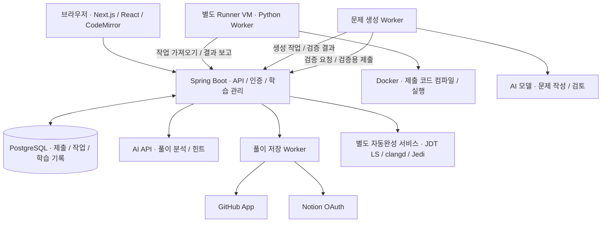

<p align="center">
  
</p>

<p align="center">
  <b>문제를 풀고, 나의 다음 연습까지 이어가는 코딩 학습 서비스</b><br>
  온라인 채점 · 선택 진단 · 맞춤 훈련 · AI 피드백 · 풀이 자동 기록
</p>

<p align="center">
  <a href="https://gamjaoj.gamjabox.cloud"><b>서비스 바로가기</b></a>
</p>

---

## 왜 만들었나

코딩 문제를 풀다 보면 익숙한 유형만 반복하거나, 정답을 맞힌 뒤에도 다음에 무엇을 공부할지 막히는 경우가 있다. GamjaOJ는 **정답을 확인하는 것에서 끝나지 않고, 부족한 부분을 찾아 다음 연습으로 연결하는 것**을 목표로 만든 개인 프로젝트다.

브라우저에서 코드를 작성하고 제출하면 채점 결과를 확인할 수 있다. 진단평가와 풀이 기록을 바탕으로 훈련 계획을 만들고, 기존 문제를 연결하거나 필요한 문제를 생성해 이어서 풀도록 구성했다. 풀이 자신감과 AI 코드 분석은 별도로 기록하여, 정답 한 번을 곧바로 숙련도로 판단하지 않도록 했다.

현재 실제 서버에서 운영하며 기능 구현뿐 아니라 제출 코드의 실행 격리, 생성 문제 검증, 재시도 처리와 화면 사용성까지 함께 개선하고 있다.

## 학습 흐름

**문제 탐색 또는 진단 → 코드 작성·제출 → 결과와 피드백 확인 → 다음 훈련 → 성장 기록**

진단평가는 선택 사항이다. 바로 문제를 풀거나, 제공되는 훈련 코스를 고르거나, 직접 연습 목표를 설정하는 방식도 지원한다.

## 주요 기능

| 기능 | 설명 |
| --- | --- |
| **온라인 채점** | Java 8·C++17·Python 3.12 실행과 제출. 채점 결과, 실행 시간, 메모리 사용량 확인 |
| **브라우저 에디터** | 언어별 자동완성, 코드 템플릿, Vim 모드, 글꼴·테마 설정, 초안 저장, 패널 순서·크기 조절. 명령 처리형 호출 테스트 편집·입력/출력 파일 불러오기 |
| **문제 탐색·출제** | 한글 분야 필터와 페이지네이션. 사용자가 만든 문제의 검증·공유, Markdown 본문과 설명 이미지 지원 |
| **선택 진단** | 기초 진단과 A/B형 대비 진단. A/B형은 각 4세트·32문항이며, 덜 노출된 세트를 우선 배정하고 재응시 여부 표시. B형은 Java·C++·Python `UserSolution` 방식 |
| **맞춤 훈련** | 진단 결과에서 계획을 생성하고 진행도·이어서 풀기를 제공. 적합한 접근 가능 문제를 우선 연결하고 부족한 문제는 생성 작업으로 준비 |
| **서비스 훈련 코스** | 입문·자료구조·탐색·그래프·동적 계획법 등 8개 코스. 수동 계획과 개인 훈련 기록도 별도 관리 |
| **풀이 피드백** | AI 분석·맞춤 힌트와 본인의 풀이 자신감을 구분해 기록. 최신 분석 요약을 먼저 보여주고 상세 내용·지난 기록은 펼쳐서 확인 |
| **마이페이지** | 활동 잔디, 성장 겹, 유형별 풀이 분포, 복습·편중 완화 제안, 풀어본 문제와 전체 제출 기록 |
| **GitHub·Notion 연동** | 정식 통과 풀이의 자동 저장 ON/OFF와 수동 저장. GitHub 겹별 폴더·README, Notion 표에 난이도·시간·메모리 기록 |

### 난이도: 생각의 겹

문제 난이도는 **1~9겹**으로 표시한다. `1겹 · 그대로`, `5겹 · 뒤집어보기`, `9겹 · 새로 짜기`처럼 숫자와 이름을 함께 보여주며, **발상·구현·경계 조건**의 부담도 구분한다.

다른 서비스의 레벨이나 티어를 그대로 환산하지 않고 문제별 검토 정보를 저장한다. 문제의 생각의 겹과 개인의 성장 겹은 서로 다른 지표이며, 겹 평가는 학습을 돕기 위한 추정치다.

## 아키텍처



프런트엔드는 정적 파일로 빌드해 Spring Boot 애플리케이션에서 함께 제공한다. 제출은 DB에 작업으로 저장하고, 별도 Runner가 가져가 실행한 뒤 결과를 보고한다. 브라우저는 작업 상태를 조회하므로 채점이 끝날 때까지 하나의 HTTP 요청을 오래 붙잡지 않는다.

사용자 코드는 웹 서버에서 직접 실행하지 않는다. Runner의 Docker 컨테이너에 네트워크·CPU·메모리·프로세스 수·실행 시간 제한을 적용하고, 실행할 언어 이미지와 명령은 서버가 관리한다.

## 기술 스택

| 영역 | 기술 | 사용 목적 |
| --- | --- | --- |
| **Backend** | Java 21, Spring Boot 3.5, Spring Security, Spring JDBC | API, 인증·권한, 작업 상태와 트랜잭션 관리 |
| **Database** | PostgreSQL, Flyway, Spring Session JDBC | 제출·학습·세션 저장, DB 변경 이력 관리 |
| **Frontend** | Next.js 16, React 19, JavaScript, CodeMirror 6 | 정적 빌드, 풀이 화면과 코드 편집기 |
| **Worker** | Python, Docker | 제출 코드 채점, 문제 생성·검증 작업 |
| **Integration** | AI API, GitHub App, Notion OAuth | 학습 피드백, 문제 생성, 풀이 기록 |
| **Testing** | JUnit, Spring Boot Test, H2, Python unittest, Playwright | 서버·검증 도구·브라우저 동작 검사 |

애플리케이션 서버는 Java 21을 사용하고, **사용자가 제출하는 Java 코드는 Java 8 기준으로 채점**한다. 서버 개발 환경과 문제 풀이 환경을 구분했다.

## 구현에서 중요하게 본 점

### 1. 오래 걸리는 작업은 요청과 분리

채점·문제 생성·외부 업로드는 즉시 끝나지 않는 작업이다. 요청을 받으면 작업과 상태를 DB에 저장하고 Worker가 처리하도록 했다. 같은 요청을 다시 보내도 새로운 작업을 무조건 만들지 않도록 요청 키를 확인하고, 작업 담당 Worker와 유효 시간을 검사한다.

현재 규모에서는 DB 기반 작업 큐를 사용한다. 별도 메시지 브로커를 추가하기보다 이미 사용하는 PostgreSQL 안에서 작업 상태와 사용자 기록을 함께 관리하는 방식을 선택했다.

### 2. AI가 만든 문제도 실제로 검증

문제 작성이 끝났다는 이유만으로 바로 공개하지 않는다. 경로에 따라 정답 코드 실행, 작은 입력의 독립 정답 비교, 예제를 통과하는 오답 코드가 숨은 테스트에서 실패하는지 확인하는 검증 등을 수행한다. 검증 결과는 정확한 문제 버전에 연결하며, 준비·검토 조건을 충족한 문제만 제공한다.

AI 분석은 학습 제안으로 취급하고 채점 결과를 바꾸지 않는다. 동일한 분석은 재사용하고, API 비활성 상태나 예산 부족은 사용자에게 보류 상태로 표시한다.

### 3. 진단 결과를 실제 연습에 연결

맞춤 계획의 단계에 맞는 기존 문제를 먼저 찾는다. 본인이 만든 문제와 다른 사용자의 공개 문제도 접근 권한과 준비 상태를 확인한 뒤 후보에 포함한다. 적합한 문제가 없으면 생성 작업으로 넘기고 준비 상태를 표시한다.

진단·계획·훈련 기록은 DB에 저장한다. 화면을 다시 열어도 진행 중인 계획을 이어갈 수 있고, 서비스 코스는 등록 시점의 구성을 보관해 이후 코스 수정이 기존 학습 순서를 바꾸지 않도록 했다.

## 대표 트러블슈팅

실제 수정 사례와 재시도 검증에서 다룬 실패 조건을 함께 정리했다. **문제 → 원인 → 해결 → 확인** 순서로 읽을 수 있다.

### 1. 문제를 바꿨는데 이전 문제의 내용이 남음

- **문제:** 다른 문제의 풀기를 눌러도 이전 본문이나 이미지가 섞여 보였다.
- **원인:** 문제 전환 때 남은 화면 상태와 늦게 도착하는 이전 요청의 응답을 함께 관리해야 했다.
- **해결:** 문제 선택 진입점을 통일하고 본문·이미지를 문제 버전에 연결했다. 전환 즉시 이전 제출 상세를 비우고, 이전 요청 결과가 새 선택을 덮어쓰지 않도록 했다.
- **확인:** 이전 이미지 응답을 일부러 늦게 보내는 브라우저 테스트와 반복 전환 테스트로 본문 분리와 코드 초안 보존을 확인했다.

관련 코드: [Workspace](frontend/app/workspace.js) · [문제 전환 테스트](frontend/tests/problem-switch.spec.mjs)

### 2. 외부 업로드에서 응답을 잃으면 중복 저장될 수 있음

- **문제:** GitHub·Notion이 저장을 완료했지만 응답만 유실된 경우, 단순 재시도는 파일이나 페이지를 다시 만들 수 있다.
- **원인:** 로컬 요청의 실패만으로 외부 서비스의 저장 실패를 판단할 수 없다.
- **해결:** 업로드 경로와 페이지 ID를 중간 상태로 저장하고, 자동 관리 표시와 기록 ID로 기존 결과를 확인한 뒤 이어서 처리한다. 저장 여부를 확인할 수 없으면 무작정 재생성하지 않는다. Notion의 개인 회고는 갱신 대상에서 제외한다.
- **확인:** 응답 유실·부분 저장 후 재시작·같은 요청 재전송을 테스트하여 저장 위치 재사용과 중복 생성 방지 동작을 확인했다. 이 회귀 테스트의 외부 API는 mock이며 실제 provider 장애를 재현한 결과와는 구분한다.

관련 코드: [풀이 저장](backend/src/main/java/dev/gamjaoj/SolutionExports.java) · [GitHub 경로 테스트](backend/src/test/java/dev/gamjaoj/GitHubSolutionLayoutTest.java) · [Notion 저장 테스트](backend/src/test/java/dev/gamjaoj/NotionTablesTest.java)

### 3. 로컬 테스트는 통과했지만 운영 DB 마이그레이션이 실패

- **문제:** 진단 문항 역할을 확장하는 마이그레이션이 운영 PostgreSQL에서 실패했다.
- **원인:** 제약조건 조회가 수정할 난이도 CHECK 외에 PostgreSQL의 NOT NULL 관련 항목까지 포함했다. H2 테스트만으로는 이 차이가 드러나지 않았다.
- **해결:** 변경할 CHECK 조건만 찾도록 조회를 수정했다. 기존 운영 버전을 복구한 뒤 별도 PostgreSQL 17 환경에서 관련 테스트를 통과시키고 다시 배포했다.
- **확인:** 진단 통합 테스트 39개와 이후 전체 검증을 통과했다. DB 관련 변경은 가벼운 테스트 DB뿐 아니라 운영 DB의 동작도 확인해야 한다는 점을 배웠다.

관련 코드: [V75 마이그레이션](backend/src/main/java/db/migration/V75__exam_diagnostic_roles.java) · [진단 통합 테스트](backend/src/test/java/dev/gamjaoj/DiagnosticIntegrationTest.java)

### 4. 테마를 바꾼 직후 색상을 저장하면 다른 테마에 반영됨

- **문제:** 다크 모드에서 바꾼 색상이 라이트 모드 설정에 저장되는 경우가 있었다.
- **원인:** 실제 화면의 테마 변경과 React 상태 갱신 사이에 시차가 있어, 저장 함수가 이전 모드의 값을 읽었다.
- **해결:** 테마 선택 시 상태를 즉시 갱신하고, 색상 저장 시 현재 활성 모드와 최신 설정을 기준으로 처리했다.
- **확인:** 모드 전환 직후 색상 변경·저장·새로고침을 반복하여 라이트/다크 설정이 각각 유지되는지 확인했다.

관련 코드: [화면 설정](frontend/app/appearance-settings.js) · [테마 테스트](frontend/tests/appearance.spec.mjs)

### 5. 피드백 기능이 늘면서 사이드바가 지나치게 길어짐

- **문제:** 회고 입력, AI 분석, 추가 질문, 지난 기록과 다음 훈련 설정이 모두 펼쳐져 핵심 피드백을 찾기 어려웠다.
- **해결:** 최신 분석 요약을 먼저 보여주고 상세 내용·질문·회고·지난 기록을 단계적으로 펼치도록 변경했다. 접힌 입력도 유지하여 열고 닫는 과정에서 초안이 사라지지 않게 했다.
- **확인:** 390·1024·1440px에서 긴 분석 12개, 키보드 펼침, 질문·회고 초안 보존과 후속 훈련 연결을 확인했다. 관련 UI 테스트 20개를 통과했다.

관련 코드: [AI 피드백](frontend/app/ai-feedback.js) · [사이드바 테스트](frontend/tests/feedback-sidebar.spec.mjs)

## 검증 방식

| 대상 | 확인 내용 |
| --- | --- |
| **서버** | 소유권·CSRF·제출 조건·작업 재시도·진단 배정·훈련 상태. 최근 전체 Maven 검증 439개 통과 |
| **채점 환경** | 정답·오답·컴파일 오류·시간 초과와 실행 메타데이터. 문제별 실제 Runner 검증 |
| **브라우저** | 모바일·데스크톱 배치, 코드 초안·undo, 문제 전환, 질문·회고 보존, 테마와 폼 동작 |
| **운영 점검** | 실제 로그인·이미지 권한·요청 재전송·서버 재시작 후 상태 복원 |

A/B형 진단 64문항은 실제 Runner에서 128개 언어별 정답 프로그램과 1,848개 고정 테스트 실행을 확인했다. 이 결과는 해당 검증 범위의 통과 기록이며, 모든 최악 입력이나 진단 세트의 난도 동등성을 보장하는 수치는 아니다.

## 프로젝트 구조

```text
GamjaOJ/
├── frontend/       화면, 코드 에디터, Playwright 테스트
├── backend/        API, 인증, 학습 관리, DB 마이그레이션
├── runner/         격리 채점 Worker와 언어별 실행 정책
├── generation/     문제 생성 Worker와 검토·난이도 기준
├── diagnostics/    진단 은행 변환·검증 도구
├── completion/     언어별 자동완성 서비스
├── problems/       공개 문제 메타데이터·출처·설명 이미지
├── tests/          Python 검증 도구 테스트
├── scripts/        빌드, 검증, 배포 도구
└── deploy/         Docker와 서비스 실행 설정
```

## 빌드와 테스트

필요한 환경은 **Node.js 20.9 이상, Docker, Python 3.9 이상**이다. 백엔드는 Java 21을 사용하며, 아래 전체 빌드 스크립트는 고정된 Maven 컨테이너 안에서 실행한다.

```sh
# 프런트엔드 빌드 + 백엔드 패키징·전체 테스트
./scripts/build-web.sh

# Python 검증 도구 테스트: 일부 검사는 Docker나 별도 실행 환경 필요
python3 -m unittest discover -s tests
```

빌드된 화면을 로컬에서 열어 UI 회귀 테스트를 실행할 수도 있다.

```sh
# 터미널 1: 빌드 결과 제공
python3 -m http.server 18788 --bind 127.0.0.1 --directory frontend/out
```

```sh
# 터미널 2: API fixture를 사용하는 화면 테스트
cd frontend
npx playwright install chromium
GAMJAOJ_BASE_URL=http://127.0.0.1:18788 npx playwright test \
  tests/feedback-sidebar.spec.mjs tests/solving-layout.spec.mjs --workers=2
```

위 화면 테스트는 실제 채점 서버나 유료 AI를 호출하지 않는다. 서비스 전체 실행에는 PostgreSQL, Worker와 환경변수 설정이 추가로 필요하며, 정적 파일 서버만으로 채점 기능이 동작하지는 않는다.

운영 자격증명·환경변수 파일·SSH 접속 정보와 비공개 문제 패키지는 저장소에 포함하지 않는다. 운영 스크립트는 `GAMJAOJ_APP_SSH_TARGET`, `GAMJAOJ_RUNNER_SSH_TARGET`, `GAMJAOJ_BASE_URL` 등의 명시적 로컬 설정을 사용한다.

## 현재 범위와 다음 개선

- A/B형 진단은 학습용 시범 진단이다. 공식 시험·합격 예측 도구가 아니며 실제 학습자 데이터에 따른 세트 난도 보정이 필요하다.
- 자동완성은 단일 파일과 설치된 표준 라이브러리를 기준으로 한다. 외부 프로젝트 의존성이나 IDE 수준의 리팩토링은 지원하지 않는다.
- 메모리는 Runner가 관측한 컨테이너 cgroup 최고 사용량으로, JVM·런타임과 파일 캐시를 포함한다. 다른 OJ의 수치와 직접 비교하는 지표로 사용하지 않는다.
- 다음 개선은 문제별 난도·시간 제한 보정, 학습자 피드백 기반 훈련 구성 개선, 다른 브라우저·실기기 검증이다.

## 출처와 관련 문서

[**iamywl/problemset**](https://github.com/iamywl/problemset)의 358문항은 운영자가 제공한 저자의 사용 허가를 바탕으로 도입했다. 원본 출처와 수정 기록을 유지하며, 자체 작성 문제와 구분한다. 세부 검증 범위는 [문제 풀 문서](problems/problemset/README.md)에 정리했다.

- [UI/UX 기준](docs/GamjaOJ_UIUX_Guidelines.md) — 글래스모피즘·뉴모피즘, 테마, 화면 구성과 접근성
- [자동완성](completion/README.md) — 언어별 지원 범위와 검증
- [풀이 저장 연동](deploy/solution-exports.md) — GitHub·Notion 설정과 저장 동작
- [A/B형 진단 검토](diagnostics/exam-ab-v2-review.md) — 검증 결과와 시범 운영 범위
